# Trabalho Final de Redes Sem Fio

Experimentos com transmissão de sinais infravermelhos usando o protocolo NEC

## Introdução

Este projeto foi desenvolvido para testar e coletar dados sobre a transmissão unidirecional de sinais infravermelhos usando o protocolo NEC. Neste documento vamos apresentar os cenários de testes e composição do projeto, bem como os dados obtidos em cada teste.

## Composição do Projeto

O diagrama do cenário de testes forma um grafo com 3 nós: Dois nós são endpoints para transmissão do sinal infravermelho (IR), e um é o terminal que recebe os dados resultantes através de conexões seriais.


A seguir vamos entrar em detalhes sobre a composição de hardware w software de cada nó.

## Nó Emissor

É composto por um LED infravermelho que é controlado por um programa no microcontrolador Raspberry Pi Pico W. Ele também contém um botão e LED comum para controlar e mostrar o estado atual do programa.

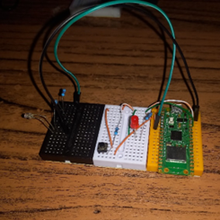
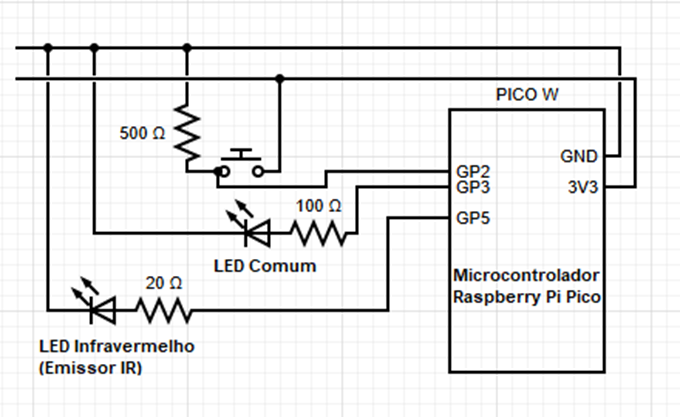

Em seguida há um pseudocódigo e uma breve explicação análogos ao programa usado neste nó. O código real foi escrito em C e usa uma biblioteca para as funções de codificação e transmissão NEC, [github/nec_transmit_library](https://github.com/raspberrypi/pico-examples/tree/master/pio/ir_nec/nec_transmit_library).

```python
# Pseudocódigo simplificando o funcionamento do emissor.
address = 0x00
delay_ms = 100

loop:
  blink_led(2) # pisca o led duas vezes
  set_led(1)
  print("[i] Ready to start a new test, press button to continue")
  wait_button_press()

  blink_led(3)
  print("[i] Test started, please wait")
  initial_time = get_us_time() # guarda o tempo inicial em microssegundos

  for data in range(0x00, 0xFF):
    # codifica e então transmite os dados usado funções da biblioteca
    frame = nec_encode_frame(address, data)
    transmit_frame(frame)
    sleep_ms(delay_ms) # dá tempo para o nó receptor decodificar dados

  final_time = get_us_time()

  # envia sinal de "final
```

Ao apertar o botão o algoritmo começa a transmitir nos números de 0 a 255 com um intervalo de 100 milissegundos entre cada transmissão.

Ao terminar, o algoritmo envia um sinal indicando o fim de transmissão para o nó receptor, e então manda o tempo que levou do começo ao fim da transmissão para o terminal.

Enfim o programa retorna ao início do e espera o apertar do botão para recomeçar a transmitir.

## Nó Receptor

É composto por um sensor de sinais infravermelhos usado pelo programa no microcontrolador. Ele também contém um botão externo para controlar o programa e LED azul embutido na placa para mostrar o estado atual do programa.

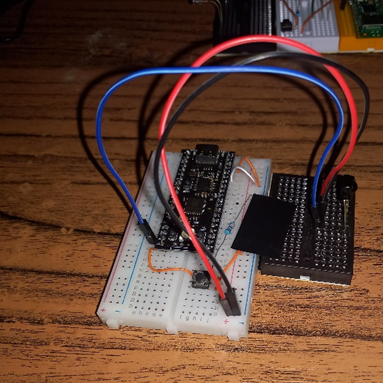
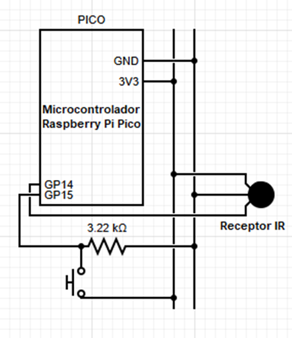

O pseudocódigo e explicação do algoritmo deste nó se encontram abaixo. Assim como o nó de transmissão, esse nó também foi originalmente escrito em C e usa uma biblioteca para as funções de detecção e decodificação de sinais NEC, [github/nec_receive_library](https://github.com/raspberrypi/pico-examples/tree/master/pio/ir_nec/nec_receive_library).

```python
# Pseudocódigo simplificando o funcionamento do nó receptor.

loop:
  blink_led(2)
  set_led(1)
  print("[i] Ready to start a new test, press button to continue")
  wait_button_press()

  blink_led(3)
  print("[i] Clearing FIFO")
  clear_nec_receptor_fifo() # limpa qualquer sinal não processado

  keep_looking_for_signals = True
  bytes_received = 0
  bytes_decoded = 0
  unexpected_bytes = 0
  previous_data = 0x00

  while keep_looking_for_signals:
    while nec_receptor_fifo_not_empty():
      if bytes_received==0: # se é o primeiro sinal detectado:
        initial_time = get_us_time()

      frame = get_nec_signal()
      bytes_received += 2

      try:
        address, data = decode_frame(frame)

        # Checa se recebeu o sinal de "fim de transmissão"
        if address==0xFF and data==0xFF:
          final_time = get_us_time()
          keep_looking_for_signals = False
          break

        bytes_decoded += 2

        # Checa por bytes inesperados
        if address != 0x00:
          unexpected_bytes += 1
        if previous_data!=0x00 and data!=previous_data:
          unexpected_bytes += 1

        previous_data = data

      except FailToDecode:
        continue

  # manda dados coletados para o terminal
  print("[i] Test finished, sending data")
  print(f"[Br]:{bytes_received}")
  print(f"[Bd]:{bytes_decoded}")
  print(f"[Bu]:{unexpected_bytes}")
  print(f"[DeltaT]:{final_time-initial_time}")
  print("[END]")
```

Com o apertar do botão, o algoritmo começa observar pelos sinais emitidos pelo outro nó.

Durante o período da transmissão o programa conta os dados recebidos usando 3 métricas.

1.	Bytes recebidos: Qualquer sinal que a biblioteca identifique, mesmo que invalido.
2.	Bytes decodificados: Qualquer sinal identificado e decodificado com sucesso.
3.	Bytes inesperados: Qualquer byte decodificado que não seque o padrão esperado de contagem de 0 a 255, ou com o endereço diferente de 0x00.

Note que cada frame tem 2 bytes, logo esperamos receber 512 bytes no fim da transmissão.

Ao receber o sinal de fim de transmissão o programa para de buscar por sinais. Ele então envia as métricas mencionada mais a diferença de tempo entre o recebimento do primeiro sinal e do último em microssegundos.

Enfim o programa retorna ao início do e espera o apertar do botão para recomeçar a transmitir.

## Terminal

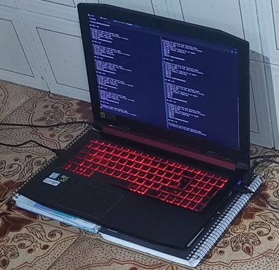

Tem como função receber os dados gerados pelos nós através de portas seriais USB.

## Experimentos

A seguir estão os dados coletados pelos experimentos. Note que os valores no campo de “Duração da Transmissão (μs)” são relativos a 2’560’000’000μs. Este é o tempo mínimo de transmissão devido pelo delay de 100 milissegundos entre cada um dos 256 sinais que são enviados em único teste.

Os primeiros 3 conjuntos de testes seguiram o seguinte cenário.

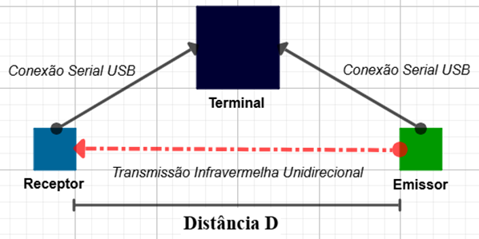

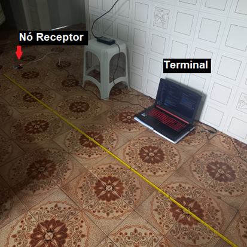
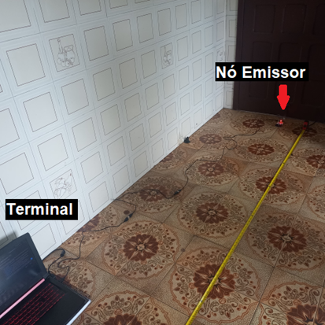

### Primeiro conjunto de testes (D=389cm)

|                    |     Receptor             |                              |                            |                                      |     Emissor                          |
|--------------------|--------------------------|------------------------------|----------------------------|--------------------------------------|--------------------------------------|
|     #     Teste    |     Bytes   Recebidos    |     Bytes   Decodificados    |     Bytes   Inesperados    |     Duração   da Transmissão (μs)    |     Duração   da Transmissão (μs)    |
|     1              |     476                  |     392                      |     38                     |     2301                             |     8                                |
|     2              |     468                  |     372                      |     42                     |     2582                             |     1                                |
|     3              |     464                  |     386                      |     38                     |     2583                             |     3                                |
|     4              |     492                  |     390                      |     34                     |     2358                             |     2                                |
|     5              |     492                  |     400                      |     43                     |     2301                             |     1                                |
|     6              |     496                  |     416                      |     27                     |     99951                            |     3                                |
|     7              |     476                  |     384                      |     43                     |     2358                             |     1                                |
|     8              |     480                  |     382                      |     41                     |     2583                             |     1                                |
|     9              |     488                  |     416                      |     31                     |     2301                             |     1                                |
|     10             |     486                  |     412                      |     32                     |     102426                           |     2                                |
|     Média          |     481.8                |     395                      |     36.9                   |     22174.4                          |     2.3                              |

### Segundo conjunto de testes (D=246cm)

|                    |     Receptor             |                              |                            |                                      |     Emissor                          |
|--------------------|--------------------------|------------------------------|----------------------------|--------------------------------------|--------------------------------------|
|     #     Teste    |     Bytes   Recebidos    |     Bytes   Decodificados    |     Bytes   Inesperados    |     Duração   da Transmissão (μs)    |     Duração   da Transmissão (μs)    |
|     1              |     510                  |     484                      |     12                     |     2301                             |     1                                |
|     2              |     508                  |     476                      |     17                     |     2301                             |     1                                |
|     3              |     510                  |     482                      |     14                     |     2695                             |     3                                |
|     4              |     508                  |     496                      |     8                      |     2358                             |     1                                |
|     5              |     512                  |     486                      |     13                     |     2413                             |     1                                |
|     6              |     506                  |     478                      |     17                     |     2414                             |     2                                |
|     7              |     498                  |     476                      |     14                     |     2413                             |     3                                |
|     8              |     508                  |     482                      |     13                     |     2301                             |     0                                |
|     9              |     506                  |     492                      |     10                     |     2639                             |     3                                |
|     10             |     514                  |     488                      |     10                     |     2695                             |     3                                |
|     Média          |     508                  |     484                      |     12.8                   |     2453                             |     1.8                              |

### Terceiro conjunto de testes (D=123cm)

|                    |     Receptor             |                              |                            |                                      |     Emissor                          |
|--------------------|--------------------------|------------------------------|----------------------------|--------------------------------------|--------------------------------------|
|     #     Teste    |     Bytes   Recebidos    |     Bytes   Decodificados    |     Bytes   Inesperados    |     Duração   da Transmissão (μs)    |     Duração   da Transmissão (μs)    |
|     1              |     512                  |     504                      |     4                      |     2413                             |     8                                |
|     2              |     512                  |     502                      |     5                      |     2413                             |     2                                |
|     3              |     514                  |     498                      |     7                      |     2301                             |     3                                |
|     4              |     514                  |     504                      |     4                      |     2300                             |     2                                |
|     5              |     508                  |     494                      |     9                      |     2695                             |     1                                |
|     6              |     512                  |     492                      |     10                     |     2413                             |     2                                |
|     7              |     510                  |     500                      |     6                      |     2413                             |     3                                |
|     8              |     512                  |     496                      |     7                      |     2414                             |     1                                |
|     9              |     514                  |     504                      |     4                      |     2582                             |     2                                |
|     10             |     510                  |     500                      |     6                      |     2414                             |     3                                |
|     Média          |     511.8                |     499.4                    |     6.2                    |     2435.8                           |     2.7                              |

### Comparação dos três primeiros conjuntos de testes

|     Distância     (cm)    |     Bytes   Recebidos    |     Bytes   Decodificados    |     Bytes   Inesperados    |
|---------------------------|--------------------------|------------------------------|----------------------------|
|     123                   |     511.8                |     499.4                    |     6.2                    |
|     246                   |     508                  |     484                      |     12.8                   |
|     389                   |     481.8                |     395                      |     36.9                   |

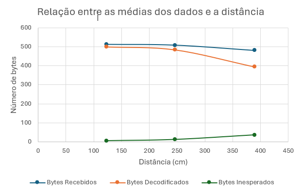

### Quarto conjunto de testes

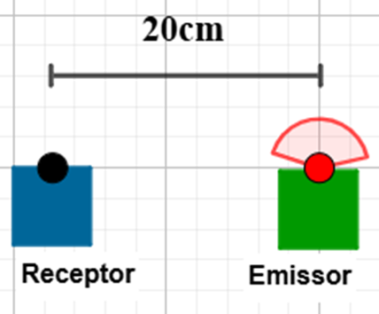
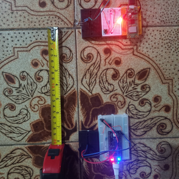

|                    |     Receptor                                                            |                              |                            |                                      |     Emissor                          |
|--------------------|-------------------------------------------------------------------------|------------------------------|----------------------------|--------------------------------------|--------------------------------------|
|     #     Teste    |     Bytes   Recebidos                                                   |     Bytes   Decodificados    |     Bytes   Inesperados    |     Duração   da Transmissão (μs)    |     Duração   da Transmissão (μs)    |
|     1              |     348                                                                 |     274                      |     28                     |     2301                             |     8                                |
|     2              |     348                                                                 |     218                      |     51                     |     2358                             |     2                                |
|     3              |     376                                                                 |     290                      |     30                     |     -197667                          |     0                                |
|     4              |     328                                                                 |     272                      |     33                     |     -199805                          |     2                                |
|     5              |     Falhou em receber sinal de fim de transmissão. Reset necessário.    |                              |                            |                                      |     1                                |
|     6              |     356                                                                 |     294                      |     29                     |     2357                             |     2                                |
|     Média          |     351.2                                                               |     269.6                    |     34.2                   |     -78091.2                         |     2.8                              |

### Quinto conjunto de testes

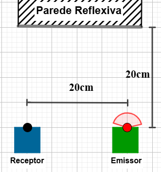
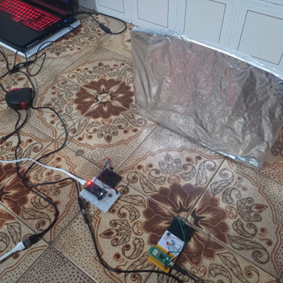

|                    |     Receptor             |                              |                            |                                      |     Emissor                          |
|--------------------|--------------------------|------------------------------|----------------------------|--------------------------------------|--------------------------------------|
|     #     Teste    |     Bytes   Recebidos    |     Bytes   Decodificados    |     Bytes   Inesperados    |     Duração   da Transmissão (μs)    |     Duração   da Transmissão (μs)    |
|     1              |     512                  |     498                      |     7                      |     2413                             |     9                                |
|     2              |     508                  |     498                      |     7                      |     2301                             |     0                                |
|     3              |     508                  |     496                      |     8                      |     2413                             |     2                                |
|     4              |     510                  |     498                      |     7                      |     2301                             |     3                                |
|     5              |     512                  |     496                      |     8                      |     2414                             |     1                                |
|     Média          |     510                  |     497.2                    |     7.4                    |     2368.4                           |     3                                |

## Protocolo NEC

O protocolo NEC descreve como codificar e transmitir dados no meio físico através de pulsos de luz infravermelha.

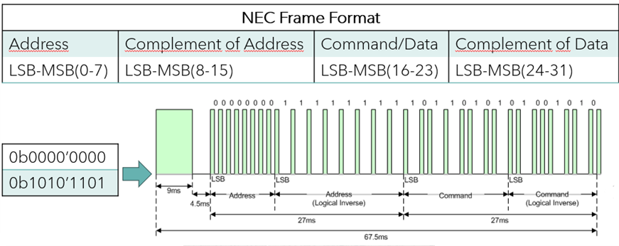

Apesar de contar com um campo para endereço, esse é normalmente definido permanentemente pela fabricante ao programar o produto. Além disso não há preocupação em reenviar dados que se perderam ou distorceram no meio.

Fazendo um paralelo com a pilha TCP/IP podemos dizer que o protocolo NEC está acima da camada física, mas não chega a ser uma implementação completa da camada de enlace.
